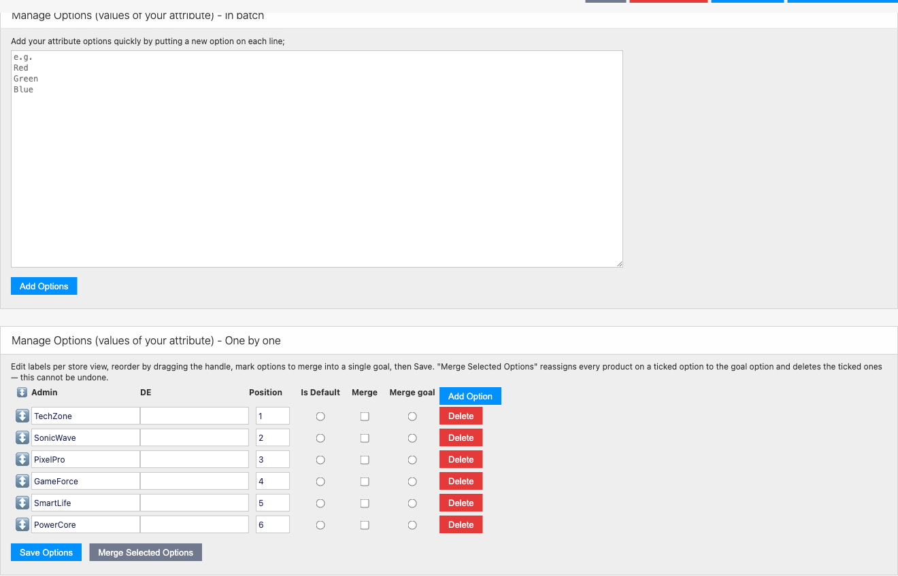

# Mageaustralia_AttributeManager

Bulk dropdown/multiselect option management for [Maho](https://github.com/mahocommerce/maho) 26.5+.

Adds a **"Bulk Options"** tab to the product-attribute edit page for `select` and `multiselect` attributes, giving you fast, safe bulk tooling that the native one-row-at-a-time options grid lacks - without touching that native grid, which is left fully intact.



- PHP 8.3+, strict types throughout, modern Maho attribute routes (`#[Maho\Config\Route]`)
- No Prototype, no Zend, no Varien_Data on JS - vanilla ES2017 only
- Zero schema changes - the module only appends a tab via an admin observer
- Portable SQL (MySQL / PostgreSQL / SQLite) for the merge operation
- OSL-3.0 (matches the Maho core base)

## Features

- **Batch-add options** - paste one value per line into a textarea to create many dropdown options at once. Values that already exist (case-insensitive) are skipped.
- **Merge options** - tick the options you want to fold away, pick a single goal option to keep, and the module reassigns **every product** from the ticked options onto the goal option (operating on `option_id`, not the label), then deletes the merged-away options. Runs in one transaction and rolls back on any error.
- **Per-store-view label editing** - edit the admin (default) label and each store-view label inline.
- **Drag-and-drop reorder** - reorder options with HTML5 drag handles; positions are rewritten on save.
- **Is Default** - set the default option (radio for `select`, checkbox for `multiselect`).
- **Delete** - remove individual options.
- All of the above live on a single **"Bulk Options"** tab added to the product-attribute edit page. The native **Manage Label / Options** grid is left completely untouched.

## Requirements

- PHP 8.3+
- Maho ^26.5

## Installation

```bash
composer require mageaustralia/maho-module-attribute-manager
./maho cache:flush
```

## Usage

1. Go to **Catalog ▸ Attributes ▸ Manage Attributes**.
2. Edit a dropdown (`select`) or multiple-select (`multiselect`) attribute.
3. Open the **"Bulk Options"** tab.
4. Use the **In batch** section to paste new values (one per line), or the **One by one** grid to edit labels, reorder, set the default, delete, or merge options.

The tab only appears for option-table-backed `select` / `multiselect` attributes - attributes with a custom source model (status, visibility, etc.) are not manageable here.

## Security model - summary

- The admin controller is in the adminhtml area → automatic admin auth + ACL (`catalog/attributes/mageaustralia_attributemanager`).
- All state-changing actions (`add`, `merge`, `save`) force `form_key` validation (`_setForcedFormKeyActions`).
- The tab is only surfaced to admin roles that hold the ACL resource.
- The merge operation validates that every submitted option_id (goal + sources) actually belongs to the target attribute before touching any product values.

## How it works

- An admin observer on `adminhtml_block_widget_tabs_html_before` appends the "Bulk Options" tab to the catalog product-attribute edit tabs block - no block rewrite, no core layout edits, fully upgrade-safe.
- Batch-add writes `eav_attribute_option` rows directly via the EAV setup resource.
- Merge re-points `catalog_product_entity_int` / `catalog_product_entity_varchar` values and configurable super-attribute pricing from the source `option_id`s to the goal, then deletes the orphaned options (their `eav_attribute_option_value` rows cascade-delete via FK).

## Development

CI: see `.github/workflows/ci.yml` - composer-validate + php-l + the maho-ci removed-Zend/Varien/Prototype scan via the shared `mageaustralia/maho-ci` reusable workflow.
